# 🚀 Spring Boot + gRPC: A Beginner's Guide

**Hands-on examples showing how gRPC works with Spring Boot** — featuring a stock trading system with all four communication patterns.

This repository contains **two separate applications**:
- **`spring-boot-with-grpc-practice`** → gRPC Server
- **`stock-trading-client`** → gRPC Client

---
### 🏗️ Stock Trading System Architecture

```
 ┌───────────────────┐                          ┌───────────────────┐                ┌────────────────────┐
 │  Stock Trading    │                          │  Stock Trading    │                │   H2 Database      │
 │     CLIENT        │◄─────────────────────────│     SERVICE       │───────────────►│   (In-Memory)      │
 │                   │      gRPC (Port 9090)    │                   │     JDBC       │                    │
 │  - Sends requests │      HTTP/2 + Protobuf   │  - Processes req  │                │  - Stock prices    │
 │  - Receives data  │                          │  - Business logic │                │  - Trading data    │
 └─────────┬─────────┘                          └─────────┬─────────┘                └────────────────────┘
           │                                              │
           │                                              │
           │                ┌──────────────┐              │
           └───────────────►│  stock.proto │◄─────────────┘
                            │              │
                            │   Contract   │
                            │  Definition  │
                            └──────────────┘
```

**Architecture Components:**

1. **📱 Stock Trading Client** (Left)
    - Spring Boot application (`stock-trading-client`)
    - Sends gRPC requests to the server
    - Uses generated gRPC stubs for type-safe calls
    - Demonstrates all 4 communication patterns

2. **📄 stock.proto Contract** (Center)
    - Protocol Buffer definition file
    - Defines 4 service methods:
        - `getStockPrice()` - Unary RPC
        - `subscribeStockPrice()` - Server Streaming
        - `bulkStockOrder()` - Client Streaming
        - `liveTrading()` - Bidirectional Streaming
    - Shared between client and server (single source of truth)

3. **🖥️ Stock Trading Service** (Right)
    - Spring Boot application (`spring-boot-with-grpc-practice`)
    - Implements all gRPC service methods
    - **Port 9090**: gRPC server
    - **Port 8080**: HTTP server (for H2 console)
    - Connected to H2 database for data persistence

4. **🗄️ H2 Database** (Service Right)
    - In-memory relational database
    - Stores stock information (symbol, price, timestamp)
    - Pre-loaded with sample data: AAPL, GOOGL, AMZN
    - Accessible via web console at `http://localhost:8080/h2-console`

**Communication Flow:**
1. Client builds a `StockRequest` using Protocol Buffers
2. Request is serialized to binary format (compact & fast)
3. Sent over HTTP/2 to server on port 9090
4. Server deserializes request, processes it, queries database
5. Server builds `StockResponse` and serializes it
6. Response sent back over same HTTP/2 connection
7.  Client receives and deserializes response to Java object

---

## 📖 What is gRPC?

**gRPC** (Google Remote Procedure Call) is a modern, high-performance, open-source RPC framework originally developed by Google. It enables efficient communication between distributed services using HTTP/2 and Protocol Buffers, making it significantly faster and more efficient than traditional REST APIs.

---

## 🤔 Why gRPC?  (Problems It Solves)

### Traditional REST API Challenges

In modern microservices architectures, traditional RESTful APIs using JSON over HTTP/1.1 face several limitations:

| Problem with REST | How gRPC Solves It |
|-------------------|-------------------|
| **Slow JSON Serialization** | Uses Protocol Buffers (binary format) - 6x faster than JSON |
| **HTTP/1.1 Limitations** | Uses HTTP/2 with multiplexing (multiple requests on one connection) |
| **Text-Based Payloads** | Binary payloads are smaller and faster to transmit |
| **No Native Streaming** | Built-in support for 4 types of streaming |
| **Loose Contracts** | Strongly-typed `.  proto` files define exact API contracts |
| **Manual Client Code** | Auto-generates client and server code in 11+ languages |
| **High Latency** | Reduced network overhead and connection reuse |

### Key Benefits of gRPC

#### 1. **🚄 High Performance**
- **Binary Protocol Buffers**: 6-10x smaller payloads than JSON
- **HTTP/2 Transport**: Multiplexed streams, header compression, server push
- **Low Latency**: Ideal for microservice-to-microservice communication

#### 2. **🌍 Cross-Language Support**
- Native support for: Java, C++, Python, Go, Ruby, C#, Node.js, PHP, Dart, Kotlin, and more
- Perfect for polyglot microservice architectures
- Write server in Java, client in Python - it just works!

#### 3. **📡 Advanced Streaming**
Unlike REST's request-response pattern, gRPC supports:
- **Unary**: Traditional request-response
- **Server Streaming**: Real-time data feeds
- **Client Streaming**: Batch uploads
- **Bidirectional Streaming**: Real-time chat, gaming, collaboration

#### 4. **📝 Strong API Contracts**
- `. proto` files act as language-agnostic API documentation
- Compiler validates contracts at build time (not runtime)
- Prevents version mismatch errors between client and server

#### 5.  **⚡ Efficient Network Usage**
- **Connection Reuse**: HTTP/2 keeps connections alive
- **Flow Control**: Prevents overwhelming slow clients/servers
- **Compression**: Built-in header and payload compression

---

## 📦 What are Protocol Buffers?

**Protocol Buffers (Protobuf)** are Google's language-neutral, platform-neutral, extensible mechanism for serializing structured data. Think of it as **"JSON on steroids"** - but smaller, faster, and type-safe.

### Why Protocol Buffers?

| Feature | JSON | Protocol Buffers |
|---------|------|------------------|
| **Format** | Text-based | Binary |
| **Size** | Larger (~100 KB) | Smaller (~10-20 KB) |
| **Speed** | Slower parsing | 6-10x faster |
| **Type Safety** | Runtime errors | Compile-time validation |
| **Schema** | Optional | Required (`. proto` file) |
| **Human Readable** | Yes | No (but tools exist) |
| **Versioning** | Manual | Built-in backward compatibility |
| **Language Support** | All | 11+ officially supported |

### How Protocol Buffers Work

#### Step 1: Define Your Data Structure (`.proto` file)

```protobuf
syntax = "proto3";

// Define a message (like a class)
message UserRequest {
    string user_id = 1;      // Tag number 1
    string email = 2;        // Tag number 2
}

message UserResponse {
    string name = 1;
    int32 age = 2;
    repeated string hobbies = 3;  // Array/List
}
```

**Key Concepts:**
- `=  1, = 2, = 3` are **tag numbers** (not default values!)
- Tag numbers are used for binary encoding (keeps data compact)
- Once assigned, **never change tag numbers** (breaks backward compatibility)

#### Step 2: Compile `. proto` to Generate Code

```bash
# Maven automatically does this during build
mvn clean install

# Generates:
# - UserRequest.java
# - UserResponse.java
# - Builder classes
# - Serialization/deserialization methods
```

#### Step 3: Use Generated Code in Your Application

```java
// Building a request (feels like using a regular Java object)
UserRequest request = UserRequest.newBuilder()
    . setUserId("12345")
    .setEmail("user@example.com")
    .build();

// Serializing to binary (happens automatically in gRPC)
byte[] binaryData = request.toByteArray();

// Deserializing from binary
UserRequest parsed = UserRequest.parseFrom(binaryData);
```

### Protocol Buffers: Field Types

| Proto Type | Java Type | Description |
|------------|-----------|-------------|
| `string` | String | UTF-8 text |
| `int32` | int | 32-bit integer |
| `int64` | long | 64-bit integer |
| `double` | double | 64-bit float |
| `float` | float | 32-bit float |
| `bool` | boolean | true/false |
| `bytes` | ByteString | Binary data |
| `repeated` | List<T> | Array/List |
| `map<K,V>` | Map<K,V> | Key-value pairs |
| `enum` | enum | Enumeration |

### Protocol Buffers: Advanced Features

#### 1. **Nested Messages**
```protobuf
message Address {
    string street = 1;
    string city = 2;
}

message User {
    string name = 1;
    Address address = 2;  // Nested message
}
```

#### 2. **Enumerations**
```protobuf
enum OrderType {
    BUY = 0;   // First value must be 0
    SELL = 1;
    HOLD = 2;
}

message StockOrder {
    OrderType type = 1;
}
```

#### 3. **Repeated Fields (Arrays)**
```protobuf
message Portfolio {
    repeated string stock_symbols = 1;  // List of strings
    repeated StockOrder orders = 2;     // List of objects
}
```

#### 4. **Maps (Key-Value Pairs)**
```protobuf
message StockPrices {
    map<string, double> prices = 1;  // symbol → price
}
```

#### 5. **Optional vs Required (Proto3)**
In proto3, all fields are **optional by default**:
```protobuf
message User {
    string name = 1;           // Optional (can be empty)
    int32 age = 2;             // Optional (defaults to 0)
}
```

### Protocol Buffers: Backward Compatibility Rules

✅ **Safe Changes:**
- Adding new fields (with new tag numbers)
- Removing optional fields (but keep tag numbers reserved)
- Changing field names (tag numbers matter, not names)

❌ **Breaking Changes:**
- Changing tag numbers of existing fields
- Changing field types (int32 → string)
- Changing repeated ↔ singular
- Removing required fields (proto2 only)

### Binary Encoding Example

**JSON vs Protobuf Size Comparison:**

```json
// JSON (85 bytes)
{
  "stock_symbol": "AAPL",
  "price": 175.50,
  "timestamp": "2025-12-06T10:30:00"
}
```

```protobuf
// Protobuf (binary, ~25 bytes)
// Field tags + wire types + compact encoding
// Human-readable representation:
stock_symbol: "AAPL"
price: 175.5
timestamp: "2025-12-06T10:30:00"
```

**Result**: 70% size reduction!

### Why Tag Numbers Matter

Protocol Buffers use **tag numbers** instead of field names in binary format:

```
JSON: {"name": "John", "age": 30}           → 26 bytes
Protobuf: [1:"John", 2:30]                  → 8 bytes (uses tags 1, 2)
```

This is why:
- Binary is compact
- Serialization is fast
- You can rename fields without breaking compatibility

---

## ⚙️ How gRPC Works (Under the Hood)

### Architecture Overview

```
┌─────────────┐                           ┌─────────────┐
│   Client    │                           │   Server    │
│             │                           │             │
│  ┌────────┐ │                           │  ┌────────┐ │
│  │ Stub   │ │  1. Method Call (Local)   │  │Service │ │
│  │(Proxy) │ ├──────────────────────────►│  │Impl    │ │
│  └────┬───┘ │                           │  └───┬────┘ │
│       │     │  2. Serialize to Protobuf │      │      │
│  ┌────▼────┐│  (Binary Format)          │ ┌────▼────┐│
│  │Protobuf ││─────────────────────────► │ │Protobuf ││
│  │Encoder  ││                           │ │Decoder  ││
│  └────┬────┘│  3. Send via HTTP/2       │ └────┬────┘│
│       │     │  (Multiplexed Stream)     │      │      │
│  ┌────▼────┐│                           │ ┌────▼────┐│
│  │HTTP/2   ││◄─────────────────────────►│ │HTTP/2   ││
│  │Transport││  4. Return Response       │ │Transport││
│  └─────────┘│  (Binary, Compressed)     │ └─────────┘│
└─────────────┘                           └─────────────┘
```

### Step-by-Step Execution Flow

#### Step 1: Define Service Contract (`.proto` file)
```protobuf
syntax = "proto3";

service StockTradingService {
    rpc getStockPrice(StockRequest) returns (StockResponse);
}

message StockRequest {
    string stock_symbol = 1;
}

message StockResponse {
    string stock_symbol = 1;
    double price = 2;
    string timestamp = 3;
}
```

#### Step 2: Code Generation
```bash
# Maven plugin generates Java classes from .proto
mvn clean install

# Generated files:
# - StockTradingServiceGrpc.java (Service interface)
# - StockRequest.java (Request message)
# - StockResponse.java (Response message)
# - Stubs for client and server
```

#### Step 3: Server Implementation
```java
@GrpcService
public class StockTradingServiceImpl extends StockTradingServiceGrpc.StockTradingServiceImplBase {
    @Override
    public void getStockPrice(StockRequest request, StreamObserver<StockResponse> responseObserver) {
        // 1. Receive deserialized request (Protobuf → Java object)
        String symbol = request.getStockSymbol();
        
        // 2. Business logic
        double price = stockRepository.findPrice(symbol);
        
        // 3. Build response (Java object)
        StockResponse response = StockResponse.newBuilder()
            .setStockSymbol(symbol)
            .setPrice(price)
            .setTimestamp(Instant.now().toString())
            . build();
        
        // 4. Send serialized response (Java object → Protobuf binary)
        responseObserver.onNext(response);
        responseObserver.onCompleted();
    }
}
```

#### Step 4: Client Call
```java
@GrpcClient("stockService")
private StockTradingServiceGrpc.StockTradingServiceBlockingStub stub;

public void callServer() {
    // 1. Build request (looks like local object)
    StockRequest request = StockRequest.newBuilder()
        .setStockSymbol("AAPL")
        . build();
    
    // 2. Call remote method (feels like local call!)
    StockResponse response = stub.getStockPrice(request);
    
    // 3.  Use response
    System.out.println("Price: " + response.getPrice());
}
```

### What Happens Behind the Scenes

1. **Client Side:**
    - Method call → **Protobuf serialization** → Binary data
    - HTTP/2 frame creation → Send over network

2. **Network Layer:**
    - HTTP/2 multiplexing (multiple calls on one TCP connection)
    - Header compression (reduces overhead)
    - Flow control (prevents buffer overflow)

3. **Server Side:**
    - Receive HTTP/2 frame → **Protobuf deserialization**
    - Execute business logic → Serialize response
    - Send back via same HTTP/2 connection

4. **Result:**
    - Client receives binary response → **Deserializes to Java object**
    - Developer sees typed object (type-safe!)

---

## 🆚 gRPC vs REST: Quick Comparison

| Feature | REST | gRPC |
|---------|------|------|
| **Protocol** | HTTP/1.1 | HTTP/2 |
| **Payload Format** | JSON (text) | Protocol Buffers (binary) |
| **Payload Size** | Larger (~100 KB) | Smaller (~10 KB for same data) |
| **Serialization** | Slow (text parsing) | Fast (binary) |
| **Type Safety** | Runtime errors | Compile-time validation |
| **Streaming** | Not natively supported | 4 types built-in |
| **Browser Support** | Full | Limited (needs grpc-web) |
| **Human Readable** | Yes (JSON) | No (binary, but tools exist) |
| **API Contract** | OpenAPI/Swagger (optional) | . proto files (required) |
| **Code Generation** | Manual or optional | Automatic |
| **Performance** | Slower (JSON + HTTP/1.1) | 6-10x faster (Protobuf + HTTP/2) |
| **Best For** | Public APIs, CRUD operations | Microservices, real-time systems |


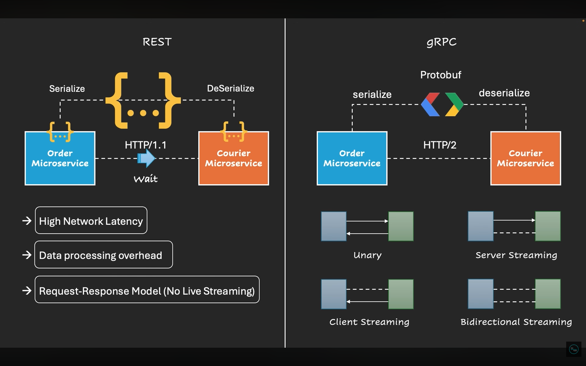
---

## 🎯 Four Ways to Communicate in gRPC

This project demonstrates all four communication patterns using a **Stock Trading System**:

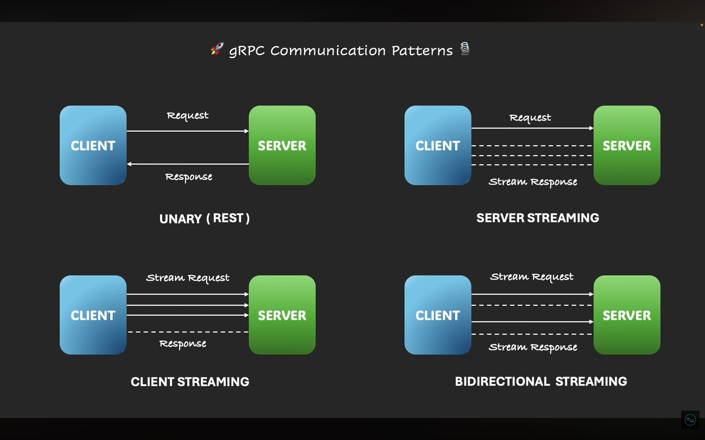

## 🎯 Simple use cases of gRPC Communications
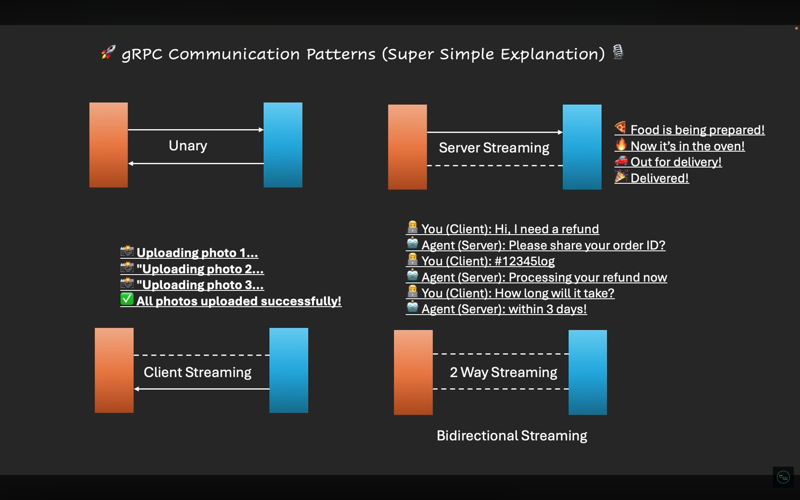

### 1️⃣ Unary RPC (Simple Request-Response)
**Like ordering pizza: You ask → They deliver**

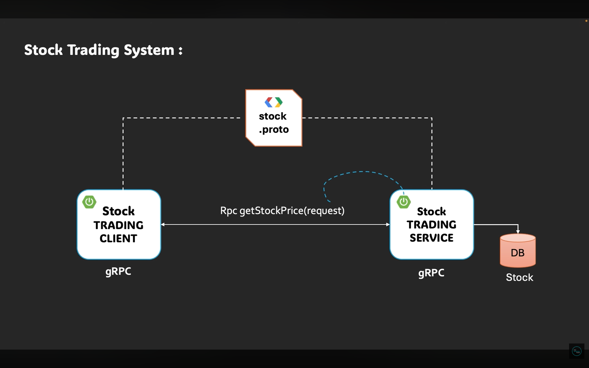

- **Example:** Get current stock price
- **Client sends:** "What's the price of AAPL?"
- **Server replies:** "AAPL is $175.50"
- **Flow:** Single request → Single response

```java
// Server: StockTradingServiceImpl. java
public void getStockPrice(StockRequest request, StreamObserver<StockResponse> responseObserver)
```

**When to use:** Fetching user profiles, checking balances, simple queries

---

### 2️⃣ Server Streaming RPC (One Request, Multiple Responses)
**Like watching a live sports score: You subscribe → Updates keep coming**

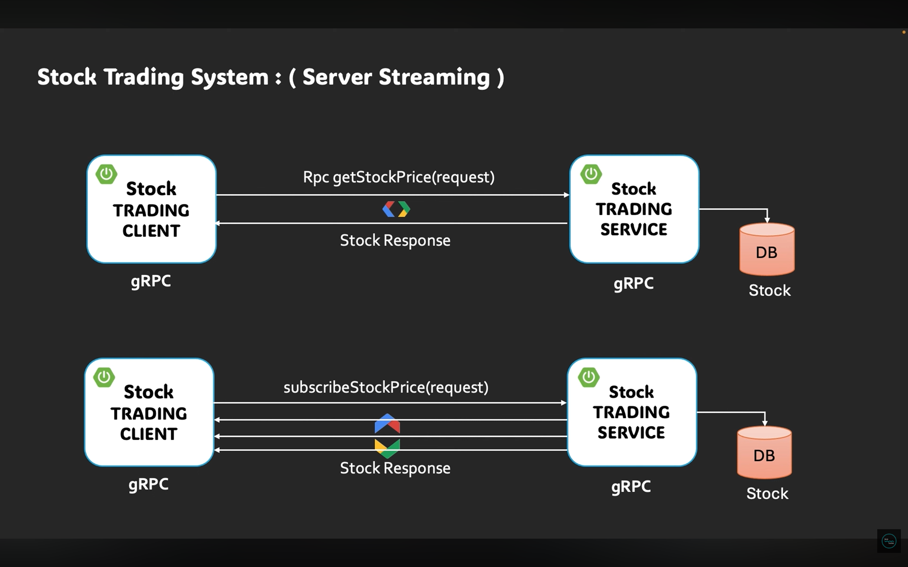

**Top**: `getStockPrice()` - Unary RPC (single request/response)  
**Bottom**: `subscribeStockPrice()` - Server Streaming (1 request → multiple responses)

- **Example:** Subscribe to live stock price updates
- **Client sends:** "Subscribe me to AAPL prices"
- **Server streams:** Price at 10:00, 10:01, 10:02...    (continuous updates)
- **Flow:** Single request → Multiple responses (stream)

```java
// Server: StockTradingServiceImpl. java
public void subscribeStockPrice(StockRequest request, StreamObserver<StockResponse> responseObserver)
```

**When to use:** Live notifications, real-time dashboards, news feeds, IoT sensor data

---

### 3️⃣ Client Streaming RPC (Multiple Requests, One Response)
**Like uploading photos in bulk: You send many → Get one confirmation**

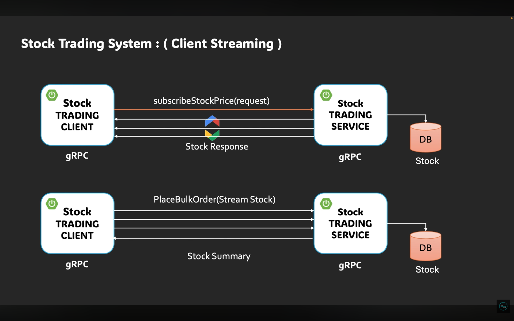

**Top**: `subscribeStockPrice()` - Server Streaming (1 request → stream of responses)  
**Bottom**: `placeBulkOrder()` - Client Streaming (stream of requests → 1 response)

- **Example:** Place bulk stock orders
- **Client streams:** Order 1, Order 2, Order 3...  (11 orders)
- **Server replies:** "Processed 11 orders, total: $15,234.56"
- **Flow:** Multiple requests (stream) → Single response

```java
// Server: StockTradingServiceImpl.java
public StreamObserver<StockOrder> bulkStockOrder(StreamObserver<OrderSummary> responseObserver)
```

**When to use:** Batch uploads, log aggregation, data migration, file uploads

---

### 4️⃣ Bidirectional Streaming RPC (Live Two-Way Chat)
**Like a phone call: Both talk and listen simultaneously**

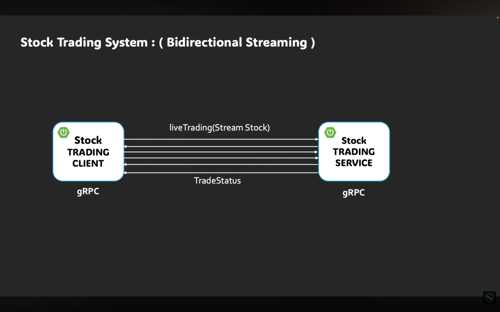

- **Example:** Live trading system
- **Client streams:** Order 1 → Order 2 → Order 3...
- **Server streams:** "Order 1 executed" → "Order 2 executed" → ...
- **Flow:** Multiple requests (stream) ⟷ Multiple responses (stream)

```java
// Server: StockTradingServiceImpl.java
public StreamObserver<StockOrder> liveTrading(StreamObserver<TradeStatus> responseObserver)
```

**When to use:** Chat apps, multiplayer games, collaborative tools, real-time trading

---

## 🧩 Tech Stack

### Server Application (`spring-boot-with-grpc-practice`)

| Component | Version |
|-----------|---------|
| **Framework** | Spring Boot 3.5.8 |
| **Java Version** | 17 |
| **Build Tool** | Maven |
| **gRPC Version** | 1.76.0 |
| **Protocol Buffers** | 4.32.1 |
| **Spring gRPC** | 0.12.0 |
| **Database** | H2 (In-Memory) |
| **ORM** | Spring Data JPA + Hibernate |
| **Web Server** | Spring Boot Starter Web (Port 8080) |
| **gRPC Server Port** | 9090 |

### Client Application (`stock-trading-client`)

| Component | Version |
|-----------|---------|
| **Framework** | Spring Boot 3.5.8 |
| **Java Version** | 17 |
| **Build Tool** | Maven |
| **gRPC Version** | 1.76.0 |
| **Protocol Buffers** | 4.32.1 |
| **gRPC Client Starter** | net.devh 3.1.0. RELEASE |
| **Spring gRPC** | 0.12.0 |

---

## 🛠️ IDE Setup (IntelliJ IDEA)

### Protocol Buffers Plugin (Recommended)

For better `. proto` file support in IntelliJ IDEA, install the **Protocol Buffers** plugin:

**Steps:**
1. Open IntelliJ IDEA
2. Go to **File → Settings → Plugins** (or **IntelliJ IDEA → Preferences → Plugins** on Mac)
3. Search for **"Protocol Buffers"**
4. Install the plugin by **JetBrains**
5. Restart IntelliJ IDEA

**Benefits:**
- ✅ Syntax highlighting for `. proto` files
- ✅ Auto-completion for protobuf keywords
- ✅ Code navigation and refactoring support
- ✅ Error detection and validation
- ✅ Integration with Maven protobuf plugin

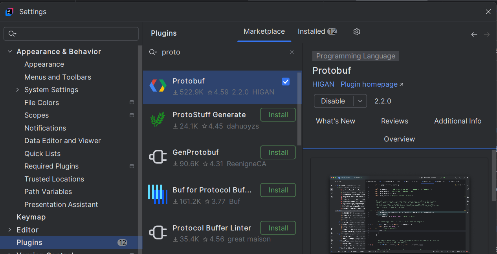

---

## 📦 Dependencies Breakdown

### Server Dependencies (`spring-boot-with-grpc-practice`)

```xml
<!-- Spring Boot Starters -->
<dependency>
    <groupId>org.springframework. boot</groupId>
    <artifactId>spring-boot-starter-data-jpa</artifactId>
</dependency>
<dependency>
    <groupId>org. springframework.boot</groupId>
    <artifactId>spring-boot-starter-web</artifactId>
</dependency>

<!-- Spring gRPC Server -->
<dependency>
    <groupId>org.springframework.grpc</groupId>
    <artifactId>spring-grpc-spring-boot-starter</artifactId>
    <version>0. 12.0</version>
</dependency>

<!-- gRPC Core Dependencies -->
<dependency>
    <groupId>io.grpc</groupId>
    <artifactId>grpc-netty-shaded</artifactId>
    <version>1. 76.0</version>
</dependency>
<dependency>
    <groupId>io.grpc</groupId>
    <artifactId>grpc-protobuf</artifactId>
    <version>1.76.0</version>
</dependency>
<dependency>
    <groupId>io.grpc</groupId>
    <artifactId>grpc-stub</artifactId>
    <version>1. 76.0</version>
</dependency>
<dependency>
    <groupId>io.grpc</groupId>
    <artifactId>grpc-services</artifactId>
</dependency>
<dependency>
    <groupId>io.grpc</groupId>
    <artifactId>grpc-census</artifactId>
    <version>1.76.0</version>
</dependency>

<!-- Protocol Buffers -->
<dependency>
    <groupId>com. google.protobuf</groupId>
    <artifactId>protobuf-java</artifactId>
    <version>4.32.1</version>
</dependency>

<!-- Database -->
<dependency>
    <groupId>com.h2database</groupId>
    <artifactId>h2</artifactId>
    <scope>runtime</scope>
</dependency>

<!-- Testing -->
<dependency>
    <groupId>org.springframework.boot</groupId>
    <artifactId>spring-boot-starter-test</artifactId>
    <scope>test</scope>
</dependency>
<dependency>
    <groupId>org. springframework.grpc</groupId>
    <artifactId>spring-grpc-test</artifactId>
    <scope>test</scope>
</dependency>
```

### Client Dependencies (`stock-trading-client`)

```xml
<!-- gRPC Client Starter (net.devh) -->
<dependency>
    <groupId>net.devh</groupId>
    <artifactId>grpc-client-spring-boot-starter</artifactId>
    <version>3.1.0.RELEASE</version>
</dependency>

<!-- gRPC Core Dependencies -->
<dependency>
    <groupId>io.grpc</groupId>
    <artifactId>grpc-netty-shaded</artifactId>
    <version>1.76. 0</version>
</dependency>
<dependency>
    <groupId>io.grpc</groupId>
    <artifactId>grpc-protobuf</artifactId>
    <version>1.76.0</version>
</dependency>
<dependency>
    <groupId>io.grpc</groupId>
    <artifactId>grpc-stub</artifactId>
    <version>1.76. 0</version>
</dependency>
<dependency>
    <groupId>io.grpc</groupId>
    <artifactId>grpc-services</artifactId>
</dependency>
<dependency>
    <groupId>io.grpc</groupId>
    <artifactId>grpc-census</artifactId>
    <version>1.76.0</version>
</dependency>

<!-- Protocol Buffers -->
<dependency>
    <groupId>com. google.protobuf</groupId>
    <artifactId>protobuf-java</artifactId>
    <version>4.32.1</version>
</dependency>

<!-- Testing -->
<dependency>
    <groupId>org.springframework.boot</groupId>
    <artifactId>spring-boot-starter-test</artifactId>
    <scope>test</scope>
</dependency>
<dependency>
    <groupId>org. springframework.grpc</groupId>
    <artifactId>spring-grpc-test</artifactId>
    <scope>test</scope>
</dependency>
```

### Build Plugin (Both Applications)

```xml
<!-- Protobuf Maven Plugin for Code Generation -->
<plugin>
    <groupId>io.github.ascopes</groupId>
    <artifactId>protobuf-maven-plugin</artifactId>
    <version>3.8.0</version>
    <configuration>
        <protocVersion>4.32.1</protocVersion>
        <binaryMavenPlugins>
            <binaryMavenPlugin>
                <groupId>io.grpc</groupId>
                <artifactId>protoc-gen-grpc-java</artifactId>
                <version>1.76.0</version>
                <options>@generated=omit</options>
            </binaryMavenPlugin>
        </binaryMavenPlugins>
    </configuration>
    <executions>
        <execution>
            <id>generate</id>
            <goals>
                <goal>generate</goal>
            </goals>
        </execution>
    </executions>
</plugin>
```

---

## ⚙️ Prerequisites Before Running

### ✔ 1. Java 17+ Installed
```bash
java -version
# Should show Java 17 or higher
```

### ✔ 2.  Maven Installed
```bash
mvn -version
# Should show Maven 3.6+
```

### ✔ 3. Port Availability
Ensure these ports are free:
- **9090** – gRPC Server (Required)
- **8080** – Spring Boot Web Server (Optional, for H2 console)

### ✔ 4. **IMPORTANT: Server Must Run Before Client**
⚠️ The **gRPC Server (`spring-boot-with-grpc-practice`) MUST be started first** before running the client application.

---

## 🗄️ Database Configuration (Server Only)

The server application uses **H2 in-memory database** for stock data persistence.

### Connecting to H2 Console
1. Start the server application
2. Open browser: 👉 **http://localhost:8080/h2-console**

| Property | Value |
|----------|-------|
| **Driver Class** | `org.h2. Driver` |
| **JDBC URL** | `jdbc:h2:mem:stocks` |
| **Username** | `sa` |
| **Password** | `password` |

### Pre-loaded Stock Data
On startup, the following stocks are automatically initialized:

```java
stockRepository.save(new Stock("AAPL", 175.50));
stockRepository.save(new Stock("GOOGL", 2800.75));
stockRepository.save(new Stock("AMZN", 3400.00));
```

---

## 🗂️ Project Structure

```
spring-boot-with-grpc-app/
│
├── images/                             # 📸 Documentation images
│   ├── intellij-proto-plugin.png
│   ├── unary-rpc.png
│   ├── server-streaming-rpc.png
│   ├── client-streaming-rpc.png
│   └── bidirectional-streaming-rpc. png
│
├── spring-boot-with-grpc-practice/     # 🖥️ gRPC SERVER
│   ├── src/main/proto/
│   │   └── stock_trading. proto         # gRPC service contract
│   ├── src/main/java/com/grpc/
│   │   ├── service/
│   │   │   └── StockTradingServiceImpl.java  # All 4 patterns implemented
│   │   ├── entity/
│   │   │   └── Stock.java              # JPA entity
│   │   ├── repo/
│   │   │   └── StockRepository.java    # Data access layer
│   │   └── SpringBootWithGrpcPracticeApplication. java
│   ├── src/main/resources/
│   │   └── application.yml             # Server config (ports: 8080, 9090)
│   └── pom.xml                         # Maven dependencies
│
└── stock-trading-client/               # 📱 gRPC CLIENT
    ├── src/main/proto/
    │   └── stock_trading.proto         # Same contract as server
    ├── src/main/java/com/grpc/client/
    │   ├── service/
    │   │   └── StockClientService.java # Calls all 4 patterns
    │   └── StockTradingClientApplication.java
    ├── src/main/resources/
    │   └── application.yml             # Client config (server address)
    └── pom. xml                         # Maven dependencies
```

---

## 🛠️ How the Proto File Defines Everything

Both applications share the **same `.proto` file** (contract):

```protobuf
syntax = "proto3";

package stock. trading;
option java_multiple_files = true;
option java_package = "com.grpc.practice";
option java_outer_classname = "StockTradingProto";

service StockTradingService {
    // 1. Unary RPC
    rpc getStockPrice(StockRequest) returns (StockResponse);
    
    // 2. Server Streaming RPC
    rpc subscribeStockPrice(StockRequest) returns (stream StockResponse);
    
    // 3. Client Streaming RPC
    rpc bulkStockOrder(stream StockOrder) returns (OrderSummary);
    
    // 4. Bidirectional Streaming RPC
    rpc liveTrading(stream StockOrder) returns (stream TradeStatus);
}

message StockRequest {
    string stock_symbol = 1;
}

message StockResponse {
    string stock_symbol = 1;
    double price = 2;
    string timestamp = 3;
}

message StockOrder {
    string order_id = 1;
    string stock_symbol = 2;
    int32 quantity = 3;
    double price = 4;
    string order_type = 5; // BUY or SELL
}

message OrderSummary {
    int32 total_order = 1;
    double total_amount = 2;
    int32 success_count = 3;
}

message TradeStatus {
    string order_id = 1;
    string status = 2;      // EXECUTED, FAILED, PENDING
    string message = 3;
    string timestamp = 4;
}
```

**Key insights:**
- The `stream` keyword tells you which side sends multiple messages
- Tag numbers (`= 1`, `= 2`) are used for binary encoding
- Once assigned, **never change tag numbers** for backward compatibility

---

## 🚦 How to Run

### Step 1: Clone the Repository
```bash
git clone https://github.com/nagarajar/spring-boot-with-grpc-app.git
cd spring-boot-with-grpc-app
```

### Step 2: Start the gRPC Server (REQUIRED FIRST)
```bash
cd spring-boot-with-grpc-practice
mvn clean install
mvn spring-boot:run
```

✅ **Server starts on:**
- gRPC port: **9090**
- Web server port: **8080** (for H2 console)

**Expected output:**
```
gRPC Server started, listening on address: *, port: 9090
Reflection service enabled
```

### Step 3: Start the gRPC Client (in a NEW terminal)
⚠️ **Important: Wait until the server is fully started before running the client**

```bash
cd stock-trading-client
mvn clean install
mvn spring-boot:run
```

✅ **Client connects to server at `localhost:9090`**

---

## 📺 Expected Console Output

### Server Console:
```
  .    ____          _            __ _ _
 /\\ / ___'_ __ _ _(_)_ __  __ _ \ \ \ \
( ( )\___ | '_ | '_| | '_ \/ _` | \ \ \ \
 \\/  ___)| |_)| | | | | || (_| |  ) ) ) )
  '  |____| . __|_| |_|_| |_\__, | / / / /
 =========|_|==============|___/=/_/_/_/

spring-boot-with-grpc-practice : Started in 2.345 seconds
gRPC Server started, listening on address: *, port: 9090

Stock order received : order_id: "ORDER-0" stock_symbol: "AACL-0" ...   
Stock order received : order_id: "ORDER-1" stock_symbol: "AACL-1" ...  
Received stock order: order_id: "ORDER-0" ...   
```

### Client Console:
```
**************** Unary grpc calling started *******************
--> Sending stock request from client: stock_symbol: "AAPL"
<-- Received Server Response: stock_symbol: "AAPL" price: 175.5 timestamp: "2025-12-06T10:30:00"
**************** Unary grpc calling ended *******************

**************** Server streaming - calling started *******************
--> Sending stock request from client: stock_symbol: "AAPL"
<-- Received Stock price update: AAPL Price: 125.67 Time: 2025-12-06T10:30:01
<-- Received Stock price update: AAPL Price: 132.89 Time: 2025-12-06T10:30:02
<-- Received Stock price update: AAPL Price: 145.23 Time: 2025-12-06T10:30:03
...   (10 updates total)
Stock price stream live update completed.   
**************** Server streaming - calling ended *******************

**************** Client streaming - calling started *******************
--> Sending stock order request from client: ORDER-0
--> Sending stock order request from client: ORDER-1
--> Sending stock order request from client: ORDER-2
...   (11 orders sent)
<-- Order summary received from server: 
Total orders: 11
Successful orders: 11
Total amount: $15234.56
Stream completed, server is done sending summary.. !   
**************** Client streaming - calling ended *******************

**************** Bidirectional streaming - calling started *******************
--> Sending stock order request from client: ORDER-0
<-- Received the trade status from server: order_id: "ORDER-0" status: "EXECUTED" message: "Order placed successfully.. !"
--> Sending stock order request from client: ORDER-1
<-- Received the trade status from server: order_id: "ORDER-1" status: "EXECUTED" message: "Order placed successfully.. !"
...   (real-time exchange continues)
Server stream completed.. ! 
**************** Bidirectional streaming - calling ended *******************
```

---

## 🔧 Configuration Files

### Server Configuration (`application.yml`)
```yaml
server:
  port: 8080

grpc:
  server:
    port: 9090
    enable-reflection: true  # Enables testing with Postman/gRPC tools

spring:
  application:
    name: spring-boot-with-grpc-practice

  datasource:
    url: jdbc:h2:mem:stocks
    driver-class-name: org.h2.Driver
    username: sa
    password: password

  jpa:
    hibernate:
      ddl-auto: update
    show-sql: true

  h2:
    console:
      enabled: true
      path: /h2-console
```

### Client Configuration (`application.yml`)
```yaml
grpc:
  client:
    stockService:
      address: "static://localhost:9090"
      negotiationType: PLAINTEXT

spring:
  application:
    name: stock-trading-client
```

---

## 💡 Key Takeaways for Beginners

| Pattern | Client Sends | Server Sends | Real-World Use | Visual                                                      |
|---------|-------------|--------------|----------------|-------------------------------------------------------------|
| **Unary** | 1 message | 1 message | Login, fetch data | 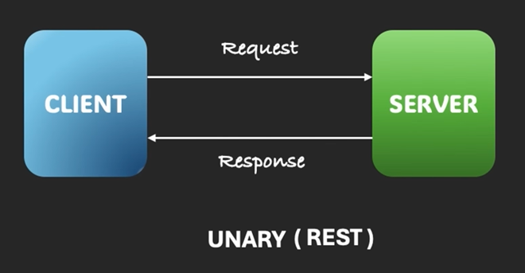                            |
| **Server Streaming** | 1 message | Many messages | Live scores, notifications | 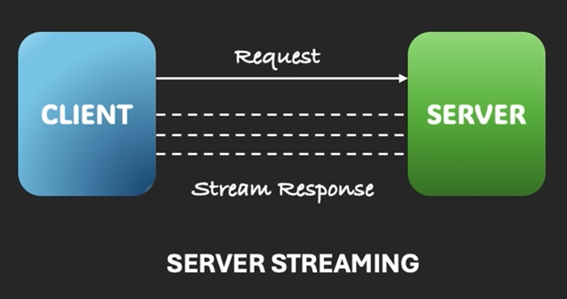      |
| **Client Streaming** | Many messages | 1 message | File uploads, batch processing | 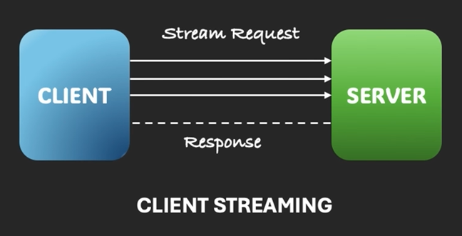     |
| **Bidirectional** | Many messages | Many messages | Chat, live collaboration | 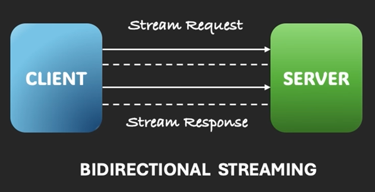 |

---

## 🐛 Troubleshooting

| Issue | Solution |
|-------|----------|
| **Port 9090 already in use** | Stop other services or change `grpc.server.port` in server's `application.yml` |
| **Connection refused** | Ensure **SERVER is started before CLIENT** |
| **Proto compilation errors** | Run `mvn clean install` to regenerate Java classes |
| **H2 console not accessible** | Check server is running on port 8080 and visit http://localhost:8080/h2-console |
| **Client can't find service** | Verify server's gRPC reflection is enabled (`enable-reflection: true`) |
| **ClassNotFoundException** | Run `mvn clean install` in both projects to generate protobuf classes |
| **No syntax highlighting in . proto files** | Install Protocol Buffers plugin in IntelliJ IDEA |
| **Protobuf compatibility errors** | Ensure both client and server use the same `. proto` file |

---

## 📚 Learn More

- [gRPC for Beginners - Java Techie YouTube](https://www.youtube.com/playlist?list=PLVz2XdJiJQxw0f6wXQCdWKabLdqSzGA0X)
- [Protocol Buffers Guide](https://developers.google.com/protocol-buffers)
- [Spring gRPC Official](https://docs.spring.io/spring-grpc/reference/)
- [net.devh gRPC Spring Boot Starter](https://github.com/yidongnan/grpc-spring-boot-starter)
- [gRPC Java Examples](https://github.com/grpc/grpc-java/tree/master/examples)
- [IntelliJ Protocol Buffers Plugin](https://plugins.jetbrains.com/plugin/14004-protocol-buffers)

---

## 🎓 What You'll Learn From This Repo

✅ **Why gRPC** - Performance benefits, streaming capabilities, cross-language support  
✅ **What are Protocol Buffers** - Binary serialization, type safety, backward compatibility  
✅ **How gRPC works** - HTTP/2, code generation, client-server communication  
✅ **Protocol Buffers syntax** - Messages, fields, tag numbers, types  
✅ How to define gRPC services using `.proto` files  
✅ Implementing all 4 communication patterns in Spring Boot  
✅ Using `StreamObserver` for async communication  
✅ Building separate server and client applications  
✅ Real-world stock trading use case  
✅ Integrating gRPC with Spring Data JPA  
✅ Protocol buffer code generation with Maven  
✅ Testing gRPC services with reflection enabled  
✅ Setting up IntelliJ IDEA for Protocol Buffers development

---